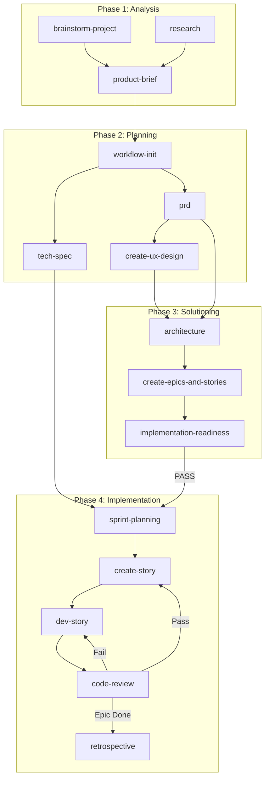

# BMM Workflow Overview

> Detailed phase-by-phase breakdown of the BMad Method Module workflow with dependencies, inputs, outputs, and context passing.

---

## Visual Workflow Representation

```
                                    BMAD BMM WORKFLOW
                                    ==================

    +-----------------+     +-----------------+     +-------------------+     +-------------------+
    |   PHASE 1       |     |   PHASE 2       |     |   PHASE 3         |     |   PHASE 4         |
    |   ANALYSIS      |     |   PLANNING      |     |   SOLUTIONING     |     |   IMPLEMENTATION  |
    |   (Optional)    |     |   (Required)    |     |   (Conditional)   |     |   (Required)      |
    +-----------------+     +-----------------+     +-------------------+     +-------------------+
           |                       |                        |                         |
           v                       v                        v                         v
    +-------------+         +-------------+          +-------------+           +-------------+
    | brainstorm  |-------->| workflow-   |--------->| architecture|---------->| sprint-     |
    | research    |         | init        |          |             |           | planning    |
    | product-    |         |             |          +------+------+           +------+------+
    | brief       |         +------+------+                 |                         |
    +-------------+                |                        v                         v
                                   v                 +-------------+           +-------------+
                           +------+------+           | create-     |           | create-     |
                           | Track       |           | epics-and-  |           | story       |
                           | Selection   |           | stories     |           +------+------+
                           +------+------+           +------+------+                  |
                                  |                        |                         v
                    +-------------+-------------+          v                  +-------------+
                    |             |             |   +-------------+           | dev-story   |
                    v             v             v   | impl-       |           +------+------+
             +-----------+ +-----------+ +-------+ | readiness   |                  |
             |Quick Flow | |BMad Method| |Enter- | | (Gate)      |                  v
             |tech-spec  | |prd + ux   | |prise  | +------+------+           +-------------+
             +-----------+ +-----------+ +-------+        |                  | code-review |
                    |             |             |         v                  +------+------+
                    |             +-------------+  PASS/CONCERNS/FAIL              |
                    |                    |              |                          v
                    |                    v              v                   +-------------+
                    |             +-------------+   Continue or            | retrospective|
                    |             | create-ux-  |   Fix Issues             +-------------+
                    |             | design      |
                    |             +-------------+
                    |                    |
                    +--------------------+
                                         |
                            Skip Phase 3 (Quick Flow)
                            or Continue to Phase 3
```

---

## Phase 1: Analysis (Optional)

### Purpose
Strategic exploration and validation before committing to detailed planning. Helps teams understand the problem space, validate market fit, and generate strategic context.

### When to Use
- Starting new projects (greenfield)
- Exploring new opportunities
- Validating market fit
- Generating ideas for complex problems

### When to Skip
- Requirements already clear
- Continuing existing projects
- Well-defined features with known solutions
- Strict constraints where discovery is complete

### Workflows

#### brainstorm-project
| Aspect | Detail |
|--------|--------|
| **Agent** | Analyst |
| **Input** | Problem description, business objectives |
| **Output** | Solution options, architecture proposals, risk analysis |
| **Context Generated** | Multiple solution tracks with trade-offs |

#### research
| Aspect | Detail |
|--------|--------|
| **Agent** | Analyst |
| **Input** | Research topic, research type (market/technical/competitive/user/domain) |
| **Output** | Research report with findings and recommendations |
| **Context Generated** | Market data, competitive landscape, technical evaluation |

#### product-brief
| Aspect | Detail |
|--------|--------|
| **Agent** | Analyst |
| **Input** | Product idea, stakeholder input |
| **Output** | Product Brief document |
| **Context Generated** | Executive summary, problem statement, MVP scope, target users |

### Context Passing to Phase 2
```
Phase 1 Outputs              -->    Phase 2 Inputs
=================                   ==============
product-brief.md             -->    prd workflow (primary input)
market-research.md           -->    prd context
technical-research.md        -->    architecture (Phase 3)
competitive-intelligence.md  -->    prd positioning
```

---

## Phase 2: Planning (Required)

### Purpose
Transform strategic vision into actionable requirements. This phase is required for ALL projects, but the depth adapts based on project complexity.

### Entry Point: workflow-init
The unified entry point that:
1. Analyzes project description for complexity
2. Presents all three tracks with trade-offs
3. Recommends appropriate track
4. Routes to correct planning workflow

### Track Selection

#### Quick Flow Track
```
workflow-init --> tech-spec --> [Skip Phase 3] --> Phase 4
```
- **Best for:** Bug fixes, simple features, clear scope
- **Planning depth:** Light (tech-spec only)
- **Story count:** 1-15 typical
- **Time:** Hours to 1 day

#### BMad Method Track
```
workflow-init --> prd --> [optional: create-ux-design] --> Phase 3
```
- **Best for:** Products, platforms, complex features
- **Planning depth:** Standard to comprehensive
- **Story count:** 10-50+ typical
- **Time:** 1-3 days

#### Enterprise Track
```
workflow-init --> prd --> [optional: create-ux-design] --> Phase 3 (extended)
```
- **Best for:** Multi-tenant, compliance, security-sensitive
- **Planning depth:** Comprehensive
- **Story count:** 30+ typical
- **Time:** 3-7 days total

### Workflows

#### prd (Product Requirements Document)
| Aspect | Detail |
|--------|--------|
| **Agent** | PM |
| **Input** | Product brief, stakeholder requirements |
| **Output** | PRD.md with FRs (Functional Requirements) and NFRs (Non-Functional Requirements) |
| **Context Generated** | Problem statement, success metrics, user personas, requirements, risks |

#### tech-spec (Quick Flow)
| Aspect | Detail |
|--------|--------|
| **Agent** | PM |
| **Input** | Feature/bug description |
| **Output** | tech-spec.md + story files |
| **Context Generated** | Problem/solution, implementation details, acceptance criteria |

#### create-ux-design
| Aspect | Detail |
|--------|--------|
| **Agent** | UX Designer |
| **Input** | PRD, user requirements |
| **Output** | ux-spec.md with user journeys, wireframes, design system |
| **Context Generated** | User flows, interaction patterns, component specifications |

### Context Passing to Phase 3
```
Phase 2 Outputs          -->    Phase 3 Inputs
===============                 ==============
PRD.md (FRs/NFRs)        -->    architecture workflow
ux-spec.md               -->    architecture (frontend design)
tech-spec.md             -->    [Skip to Phase 4]
```

---

## Phase 3: Solutioning (Conditional)

### Purpose
Translate WHAT to build (from Planning) into HOW to build it (technical design). Prevents agent conflicts by documenting architectural decisions before implementation.

### Required For
- BMad Method (complex projects)
- Enterprise Method

### Skip For
- Quick Flow (simple projects)
- BMad Method (simple projects with straightforward tech stack)

### Why Solutioning Matters
```
WITHOUT Solutioning:
Agent 1 implements Epic 1 using REST API
Agent 2 implements Epic 2 using GraphQL
Result: Inconsistent API design, integration nightmare

WITH Solutioning:
Architecture workflow decides: "Use GraphQL for all APIs"
All agents follow architecture decisions
Result: Consistent implementation, no conflicts
```

### Workflows

#### architecture
| Aspect | Detail |
|--------|--------|
| **Agent** | Architect |
| **Input** | PRD (FRs/NFRs), UX spec (if exists) |
| **Output** | architecture.md with ADRs (Architecture Decision Records) |
| **Context Generated** | System design, data architecture, API design, security, deployment |

**Key Sections in architecture.md:**
1. Architecture Overview (principles, style)
2. System Architecture (components, communication)
3. Data Architecture (database, caching, state)
4. API Architecture (style, auth, versioning)
5. Frontend Architecture (framework, state management)
6. Integration Architecture (third-party, events)
7. Security Architecture (auth, data protection)
8. Deployment Architecture (CI/CD, environments)
9. ADRs (key decisions with rationale)
10. FR/NFR-Specific Guidance
11. Standards and Conventions

#### create-epics-and-stories
| Aspect | Detail |
|--------|--------|
| **Agent** | PM |
| **Input** | PRD (FRs/NFRs), architecture.md |
| **Output** | Epic files with user stories |
| **Context Generated** | Story breakdown, acceptance criteria, dependencies, priorities |

**Why AFTER Architecture:**
- Story sizing informed by technical decisions
- Dependencies revealed by architecture
- Technical feasibility known
- Stories align with documented patterns

#### implementation-readiness (Gate Check)
| Aspect | Detail |
|--------|--------|
| **Agent** | Architect |
| **Input** | PRD, architecture.md, epic files |
| **Output** | implementation-readiness.md with gate decision |
| **Context Generated** | Completeness assessment, alignment validation, gap analysis |

**Gate Decisions:**
- **PASS:** All critical criteria met, proceed to Phase 4
- **CONCERNS:** Minor gaps, proceed with caution
- **FAIL:** Critical issues, must resolve before Phase 4

### Context Passing to Phase 4
```
Phase 3 Outputs                -->    Phase 4 Inputs
===============                       ==============
architecture.md                -->    All dev agents reference during implementation
Epic files                     -->    sprint-planning, create-story
implementation-readiness.md    -->    Confirms readiness
ADRs                          -->    dev-story, code-review validation
```

---

## Phase 4: Implementation (Required)

### Purpose
Sprint-based story development following a story-centric workflow where each story moves through a defined lifecycle.

### Key Principle
**One story at a time** - complete each story's full lifecycle before starting the next.

### Story Lifecycle States
```
TODO --> IN PROGRESS --> READY FOR REVIEW --> DONE
```

### Sprint Flow
```
Sprint 0 (Phases 1-3 complete)
    |
    v
Sprint 1+ Start
    |
    +---> sprint-planning (SM, once at Phase 4 start)
    |
    +---> Per Epic:
    |         |
    |         +---> Per Story (repeat until epic complete):
    |         |         |
    |         |         +---> create-story (SM)
    |         |         +---> dev-story (DEV)
    |         |         +---> code-review (DEV)
    |         |         +---> [If review fails: fix in dev-story, re-review]
    |         |         +---> deploy-story (DEV) [Auto-triggered on review pass]
    |         |               - Atlas validation
    |         |               - feature → develop → staging → main
    |         |               - Delete feature branch
    |         |               - Update Atlas memory
    |         |
    |         +---> retrospective (SM) [After epic complete]
    |
    +---> Next Epic
```

### Workflows

#### sprint-planning
| Aspect | Detail |
|--------|--------|
| **Agent** | SM (Scrum Master) |
| **Input** | Epic files, architecture.md |
| **Output** | sprint-status.yaml (tracking file) |
| **Context Generated** | Sprint organization, story sequence, dependencies |

#### create-story
| Aspect | Detail |
|--------|--------|
| **Agent** | SM |
| **Input** | Epic backlog, sprint-status.yaml |
| **Output** | Story file ready for development |
| **Context Generated** | Detailed acceptance criteria, technical notes, dependencies |

#### dev-story
| Aspect | Detail |
|--------|--------|
| **Agent** | DEV |
| **Input** | Story file, architecture.md |
| **Output** | Working code + tests |
| **Context Generated** | Implementation details, test coverage, code changes |

#### code-review
| Aspect | Detail |
|--------|--------|
| **Agent** | DEV (Senior role) |
| **Input** | Implemented story, code changes |
| **Output** | Review feedback, approval/rejection |
| **Context Generated** | Quality assessment, issues found, architectural compliance |

#### deploy-story
| Aspect | Detail |
|--------|--------|
| **Agent** | DEV |
| **Input** | Completed story (status: done), current branch |
| **Output** | Deployed code, deleted feature branch, updated Atlas memory |
| **Context Generated** | Deployment knowledge, workflow impacts, branch cleanup |

**Deployment Pipeline:**
1. **Pre-validation:** Atlas checks architectural alignment
2. **Merge to develop:** Integrates feature into development branch
3. **Promote to staging:** Pre-production verification
4. **Deploy to production:** Live release with confirmation
5. **Cleanup:** Delete feature branch, update sprint status
6. **Knowledge sync:** Feed deployment to Atlas memory

#### retrospective
| Aspect | Detail |
|--------|--------|
| **Agent** | SM |
| **Input** | Completed epic, sprint learnings |
| **Output** | Retrospective notes |
| **Context Generated** | Lessons learned, process improvements, patterns to repeat/avoid |

---

## Context Flow Summary

```
                    CONTEXT FLOW THROUGH PHASES
                    ============================

Phase 1          Phase 2           Phase 3            Phase 4
========         ========          ========           ========

product-brief --> PRD (FRs/NFRs) --> architecture.md --> sprint-status.yaml
                       |                  |                    |
market-research ------>|                  |                    |
                       v                  v                    v
               ux-spec.md -------> epic files ---------> story files
                                         |                    |
                                         v                    v
                            impl-readiness.md           code + tests
                                         |                    |
                                     GATE CHECK          code-review
                                         |                    |
                                  PASS/CONCERNS/FAIL    retrospective
```

### Key Context Documents

| Document | Created In | Used By |
|----------|------------|---------|
| product-brief.md | Phase 1 | prd workflow |
| PRD.md | Phase 2 | architecture, create-epics-and-stories |
| ux-spec.md | Phase 2 | architecture |
| architecture.md | Phase 3 | create-epics-and-stories, dev-story, code-review |
| epic files | Phase 3 | sprint-planning, create-story |
| sprint-status.yaml | Phase 4 | All Phase 4 workflows |
| story files | Phase 4 | dev-story, code-review |

---

## Workflow Dependencies



---

## Next Steps

- [Quality Gates](./quality-gates.md) - All validation checkpoints
- [Atlas Integration](./atlas-integration.md) - How Atlas enhances the workflow
- [Future Roadmap](./future-roadmap.md) - Planned enhancements
