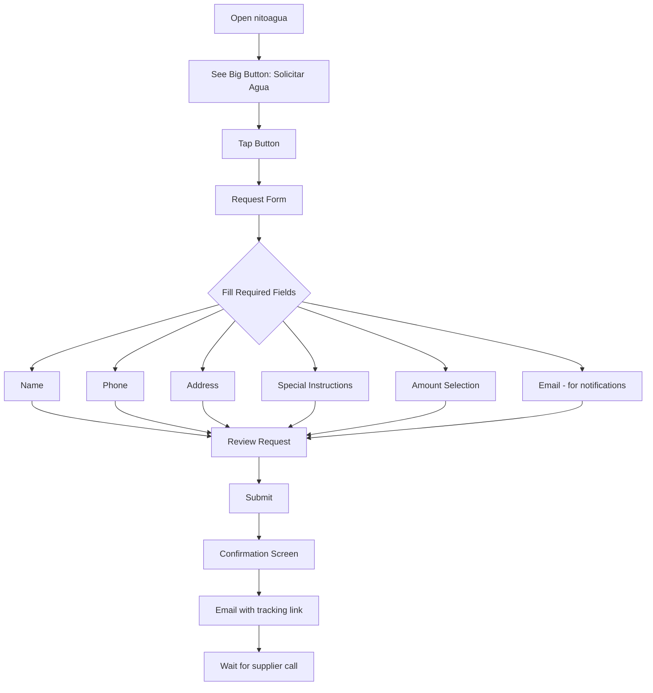
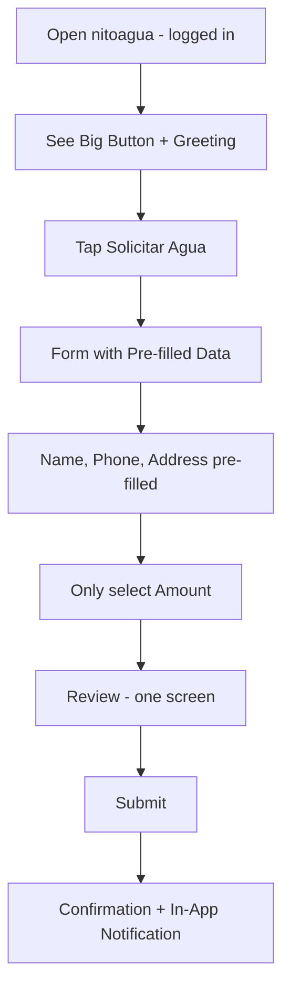
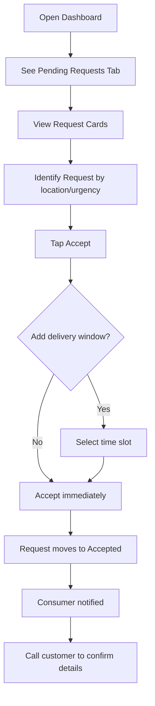
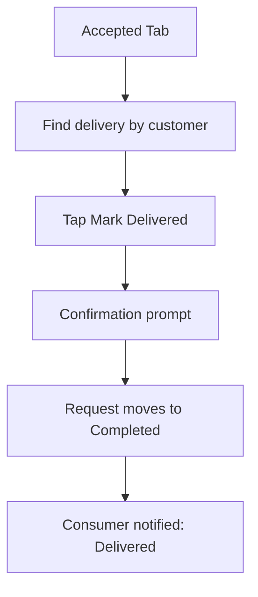

# nitoagua UX Design Specification

_Created on 2025-12-01 by Gabe_
_Generated using BMad Method - Create UX Design Workflow v1.0_

---

## Executive Summary

**Project:** nitoagua - A water delivery coordination platform for rural Chile that connects water consumers (rural households) with cistern truck operators through a simple PWA. It replaces scattered WhatsApp, Facebook, and phone-based coordination with a single point of contact.

**Target Users:**

1. **"Dona Maria" (Consumer)** - 58yo, rural Chilean, Android phone set up by daughter, NOT tech-savvy. Orders water 1-5x/week to fill her household tank. Currently frustrated by searching old Facebook pages, outdated WhatsApp contacts, and having to re-explain her location every time.

2. **"Don Pedro" (Supplier)** - 42yo, one-man cistern truck operation, tech-comfortable, ~60 customers/month. Frustrated by requests scattered across WhatsApp, Facebook, and phone - wants to see ALL requests in ONE place.

**Core Problem:** Ad-hoc, fragmented communications across multiple platforms. Both sides rely on memory and scattered notes.

**Key Design Principle:** Asymmetric Simplicity
- **Consumers:** Ultra-simple, zero-friction, one-thumb operation in 30 seconds
- **Suppliers:** Feature-rich dashboard, efficiency-focused, power-user tools

**Desired Emotional Response:**
- **Consumers:** Relief and confidence - "I pressed the button and they'll call me back. Done."
- **Suppliers:** Control and clarity - "Finally, I can see everything in one place."

**Inspiration Analysis:**
- **Uber:** Request service → get confirmation → done. The "Where to?" simplicity.
- **Airbnb:** Providers post offerings, buyers browse and book, platform handles coordination.
- **Key Insight:** Dedicated to ONE service, platform handles logistics, users just make requests.

---

## 1. Design System Foundation

### 1.1 Design System Choice

**Selected:** shadcn/ui with Tailwind CSS

**Rationale:**
- Built on Radix UI primitives with WCAG accessibility compliance built-in
- Full code ownership - no external dependencies or version lock-in
- Highly customizable theming for the "Agua Pura" color palette
- Works seamlessly with React/Next.js for PWA development
- AI-friendly code that's easy to maintain and extend
- Excellent documentation and active community

**What shadcn/ui Provides:**
- Button, Input, Select, Card, Dialog, Toast components
- Form validation patterns with React Hook Form integration
- Responsive grid and layout utilities via Tailwind
- Dark mode support (future consideration)
- 40+ accessible components ready to customize

**Custom Components Needed:**
1. **RequestCard** - Water request summary for supplier dashboard
2. **StatusBadge** - Visual status indicator (Pending/Accepted/Delivered)
3. **AmountSelector** - Water volume selection grid (100L, 1000L, 5000L, 10000L)
4. **BigActionButton** - Large circular CTA for consumer home screen

---

## 2. Core User Experience

### 2.1 Defining Experience

**Consumer:** "Press the button, get called back with a delivery time."

This is the ONE thing that defines nitoagua for consumers. Like Uber's "Where to?" - the entire experience centers on a single, obvious action. Everything else is secondary.

**Supplier:** "See ALL my requests in ONE place instead of hunting through apps."

The supplier dashboard replaces the Monday evening chaos of checking WhatsApp, Facebook, and phone notes. One unified view of all pending requests.

### 2.2 Core Experience Principles

| Principle | Consumer | Supplier |
|-----------|----------|----------|
| **Speed** | 30 seconds to submit request | Instant overview of all requests |
| **Guidance** | Minimal - obvious single action | Moderate - clear dashboard navigation |
| **Flexibility** | Low - simple predefined options | High - sort, filter, batch actions |
| **Feedback** | Clear status: Pending → Accepted → Delivered | Confirmation toasts, status updates |

### 2.3 Novel UX Patterns

**No novel patterns required.** nitoagua uses established patterns:
- Request submission (standard form flow)
- Status tracking (linear progression)
- Dashboard management (list/card views)
- Location input (Google Maps integration)

The innovation is in the SIMPLICITY, not the interaction mechanics.

---

## 3. Visual Foundation

### 3.1 Color System

**Selected Theme:** Agua Pura (Trust Blue)

| Role | Color | Hex | Usage |
|------|-------|-----|-------|
| Primary | Ocean Blue | `#0077B6` | Main actions, key elements, brand |
| Secondary | Sky Blue | `#00A8E8` | Supporting actions, accents |
| Primary Light | Foam | `#CAF0F8` | Backgrounds, highlights |
| Primary Dark | Deep Ocean | `#03045E` | Text on light backgrounds |
| Success | Emerald | `#10B981` | Delivered, completed, positive |
| Warning | Amber | `#F59E0B` | Pending, attention needed |
| Error | Red | `#EF4444` | Errors, urgent, cancel |
| Neutral | Gray | `#6B7280` | Secondary text, borders |

**Why This Palette:**
- Blue evokes water and trust - directly relevant to the product
- High contrast ensures readability in outdoor/bright conditions (rural users)
- Clean and professional without feeling corporate
- Accessible color contrast ratios (WCAG AA compliant)

### 3.2 Typography System

**Font Family:** System fonts for performance and familiarity
```css
font-family: -apple-system, BlinkMacSystemFont, 'Segoe UI', Roboto, Oxygen, Ubuntu, sans-serif;
```

**Type Scale:**
| Level | Size | Weight | Usage |
|-------|------|--------|-------|
| H1 | 24px | 700 | Page titles |
| H2 | 20px | 600 | Section headers |
| H3 | 16px | 600 | Card headers |
| Body | 16px | 400 | Main content (mobile) |
| Body Desktop | 14px | 400 | Dashboard content |
| Small | 13px | 400 | Secondary info |
| Tiny | 11px | 500 | Labels, badges |

**Minimum Text Size:** 16px on mobile to prevent zoom on focus.

### 3.3 Spacing System

**Base Unit:** 4px

| Token | Value | Usage |
|-------|-------|-------|
| xs | 4px | Tight spacing, inline elements |
| sm | 8px | Between related elements |
| md | 16px | Standard component padding |
| lg | 24px | Section spacing |
| xl | 32px | Major sections |
| 2xl | 48px | Hero areas |

**Touch Targets:** Minimum 44x44px (WCAG requirement for accessibility)

**Interactive Visualizations:**

- Color Theme Explorer: [ux-color-themes.html](./ux-color-themes.html)

---

## 4. Design Direction

### 4.1 Chosen Design Approach

**Consumer Experience:** Big Button Focus + Direct Form

The consumer home screen features a dominant, impossible-to-miss "Solicitar Agua" button. When tapped, it leads to a streamlined form with pre-filled data for registered users.

**Key Design Decisions:**
- Single large circular CTA button (200x200px)
- Water-blue gradient background on button
- Minimal navigation (Home, History, Profile)
- Status displayed below main action
- Form fields pre-filled from profile

**Supplier Experience:** Card-Based Dashboard

The supplier sees requests as visual cards, each containing all key information at a glance with clear accept/decline actions.

**Key Design Decisions:**
- Tab navigation (Pending, Accepted, Completed)
- Request cards with color-coded urgency
- One-tap accept action
- Customer details visible without extra clicks
- Statistics header showing counts

**Layout Decisions:**
- Navigation: Bottom nav for consumer (mobile), sidebar for supplier (desktop)
- Content structure: Single column consumer, multi-column supplier
- Content organization: Cards for both (simpler than tables)
- Visual density: Spacious for consumer, balanced for supplier

**Interactive Mockups:**

- Design Direction Showcase: [ux-design-directions.html](./ux-design-directions.html)

---

## 5. User Journey Flows

### 5.1 Critical User Paths

#### Journey 1: Consumer Water Request (Guest)

**Goal:** Submit a water request without an account



**Flow Details:**
| Step | Screen | User Action | System Response |
|------|--------|-------------|-----------------|
| 1 | Home | Tap "Solicitar Agua" | Open request form |
| 2 | Form | Enter name | Validate not empty |
| 3 | Form | Enter phone | Validate Chilean format |
| 4 | Form | Enter address | Show map picker option |
| 5 | Form | Add special instructions | Free text field |
| 6 | Form | Select amount (100L-10000L) | Show price for selection |
| 7 | Form | Enter email | Validate email format |
| 8 | Review | Tap "Enviar Solicitud" | Submit request |
| 9 | Confirmation | View request number | Send email confirmation |

**Error Recovery:**
- Invalid phone → Show format hint, keep other data
- Connection lost → Queue request, retry when online
- Supplier unresponsive → Reminder to call supplier directly

---

#### Journey 2: Consumer Water Request (Registered)

**Goal:** Submit a water request with saved profile



**Time to Complete:** Under 30 seconds (vs. 2+ minutes for guest)

---

#### Journey 3: Supplier Accept Request

**Goal:** Accept an incoming water request



**Flow Details:**
| Step | Action | System Response |
|------|--------|-----------------|
| 1 | View dashboard | Show all pending requests |
| 2 | Scan request cards | See name, location, amount, urgency |
| 3 | Tap "Aceptar" | Open optional delivery window modal |
| 4 | Confirm acceptance | Move to Accepted tab |
| 5 | System notifies consumer | Email/in-app notification sent |

---

#### Journey 4: Supplier Complete Delivery

**Goal:** Mark a delivery as completed



---

### 5.2 Flow Approach Decisions

| Journey | Approach | Rationale |
|---------|----------|-----------|
| Guest Request | Wizard (step by step) | More guidance for unfamiliar users |
| Registered Request | Single-screen | Speed - pre-filled data |
| Supplier Accept | Inline action | Quick decisions, stay in context |
| Mark Delivered | Single tap + confirm | Prevent accidental completions |

---

## 6. Component Library

### 6.1 Component Strategy

**From shadcn/ui (standard):**
- Button (primary, secondary, destructive, ghost)
- Input, Textarea, Select
- Card, CardHeader, CardContent, CardFooter
- Dialog, AlertDialog
- Toast notifications
- Badge
- Tabs
- Form with validation

**Custom Components:**

#### BigActionButton
**Purpose:** Dominant CTA for consumer home screen

**Anatomy:**
- Container: 200x200px circle
- Icon: 48x48px water drop or plus
- Label: "Solicitar Agua" text
- Gradient: primary to secondary blue

**States:**
- Default: Blue gradient, subtle shadow
- Hover/Focus: Scale 1.05, enhanced shadow
- Active: Scale 0.98, darker gradient
- Loading: Pulse animation
- Disabled: Gray, no shadow

---

#### RequestCard
**Purpose:** Display water request summary for suppliers

**Anatomy:**
- Header: Request ID, time ago
- Title: Customer name
- Location: Address + special instructions preview
- Volume badge: Amount with color
- Urgency indicator: Left border color
- Actions: Accept, View Details buttons

**States:**
- Default: White background, subtle border
- Hover: Light blue background
- Urgent: Red left border
- Selected: Blue border

**Variants:**
- Compact: For lists, less padding
- Expanded: Shows full special instructions

---

#### StatusBadge
**Purpose:** Visual indicator for request status

**Variants:**
| Status | Color | Label |
|--------|-------|-------|
| Pending | Amber (#F59E0B) | Pendiente |
| Accepted | Blue (#0077B6) | Aceptada |
| Delivered | Green (#10B981) | Entregada |
| Cancelled | Gray (#6B7280) | Cancelada |

---

#### AmountSelector
**Purpose:** Select water volume with price display

**Anatomy:**
- Grid of 4 options (2x2)
- Each option: Volume label, price below
- Selected state: Blue border, light blue bg

**Options:**
- 100L - $5.000
- 1000L - $15.000
- 5000L - $45.000
- 10000L - $80.000

---

## 7. UX Pattern Decisions

### 7.1 Consistency Rules

These patterns ensure nitoagua behaves consistently across all screens.

#### Button Hierarchy

| Level | Style | Usage |
|-------|-------|-------|
| Primary | Solid blue (#0077B6), white text | Main action per screen |
| Secondary | White, blue border and text | Alternative actions |
| Tertiary/Ghost | Transparent, blue text | Navigation, minor actions |
| Destructive | Red (#EF4444) | Cancel, delete |

**Rule:** Only ONE primary button per screen section.

---

#### Feedback Patterns

| Event | Pattern | Position | Duration |
|-------|---------|----------|----------|
| Success | Toast | Top center | 4 seconds |
| Error | Inline + Toast | Below field + top | Until dismissed |
| Warning | Toast | Top center | 6 seconds |
| Loading | Skeleton/Spinner | In place | Until loaded |

**Request Status Updates:**
- In-app: Toast notification + badge update
- Email: For guests without accounts
- Never: Push notifications (MVP limitation)

---

#### Form Patterns

| Element | Decision |
|---------|----------|
| Label position | Above input |
| Required indicator | Asterisk (*) after label |
| Validation timing | On blur (submit validates all) |
| Error display | Below field, red text |
| Help text | Below input, gray, smaller font |

---

#### Modal Patterns

| Type | Size | Dismiss |
|------|------|---------|
| Confirmation | Small (max 400px) | Explicit button only |
| Form modal | Medium (max 500px) | X button, explicit cancel |
| Full-screen | Full on mobile | Back arrow |

**Focus:** Auto-focus first interactive element.

---

#### Empty State Patterns

| Context | Message | Action |
|---------|---------|--------|
| No requests (consumer) | "No tienes solicitudes activas" | Show big button |
| No requests (supplier) | "No hay solicitudes pendientes" | Show availability toggle |
| No history | "Tu historial esta vacio" | "Solicitar Agua" button |

---

#### Confirmation Patterns

| Action | Confirmation |
|--------|--------------|
| Cancel request | Dialog: "Seguro que quieres cancelar?" |
| Accept request | Inline (no dialog - quick action) |
| Mark delivered | Dialog: "Confirmar entrega completada?" |
| Delete account | Dialog with text input confirmation |

---

#### Navigation Patterns

**Consumer (Mobile):**
- Bottom navigation bar with 3 items
- Icons + labels always visible
- Active state: Filled icon, primary color

**Supplier (Desktop):**
- Left sidebar, collapsed on mobile
- Icon + text, expandable sections
- Active state: Background highlight

---

## 8. Responsive Design & Accessibility

### 8.1 Responsive Strategy

**Breakpoints:**

| Name | Width | Layout | Nav |
|------|-------|--------|-----|
| Mobile | < 640px | Single column | Bottom bar |
| Tablet | 640-1024px | Single column, wider cards | Bottom bar |
| Desktop | > 1024px | Multi-column supplier | Sidebar |

**Adaptation Patterns:**

| Element | Mobile | Tablet | Desktop |
|---------|--------|--------|---------|
| Consumer home | Full-screen button | Same | Same (rare use case) |
| Request form | Full width | Centered 480px max | Centered 480px max |
| Supplier dashboard | Single card column | 2 columns | 3 columns |
| Navigation | Bottom bar | Bottom bar | Left sidebar |
| Request cards | Full width | 2-up grid | 3-up grid |
| Tables | Card view | Card view | Table view |

**Touch Considerations:**
- All interactive elements: Minimum 44x44px
- Swipe gestures: Not used (keep simple)
- Forms: Large inputs, adequate spacing

---

### 8.2 Accessibility Strategy

**Compliance Target:** WCAG 2.1 Level AA

**Why AA:**
- Target users include older adults (60+)
- Rural usage often in challenging lighting conditions
- Legal coverage for potential government partnerships
- Right balance of compliance vs. implementation effort

**Requirements:**

| Category | Requirement | Implementation |
|----------|-------------|----------------|
| Color contrast | 4.5:1 minimum (text) | Verified with all theme colors |
| Touch targets | 44x44px minimum | All buttons, links, inputs |
| Keyboard nav | All interactive elements | Tab order, focus indicators |
| Focus indicators | Visible 2px outline | Blue (#0077B6) focus ring |
| Form labels | Associated labels | htmlFor + id pairing |
| Error identification | Clear descriptions | Icon + text + color |
| Alt text | All meaningful images | Descriptive alt attributes |
| Screen reader | ARIA where needed | Radix primitives handle this |

**Testing Strategy:**
- Automated: Lighthouse, axe DevTools on every build
- Manual: Keyboard-only navigation testing
- Screen reader: VoiceOver (iOS) and TalkBack (Android) testing

---

## 9. Implementation Guidance

### 9.1 Development Priorities

**Phase 1: Core Flow (MVP)**
1. Consumer request form (guest + registered)
2. Request status tracking
3. Supplier dashboard with request cards
4. Accept/complete request actions
5. Email notifications for guests

**Phase 2: Polish**
1. Pre-filled forms for registered users
2. Location map picker
3. In-app notifications for registered users
4. Supplier availability toggle

**Phase 3: Enhancement (v2)**
1. Map view for suppliers
2. Route suggestion basics
3. Neighbor bundling notifications

### 9.2 Component Implementation Order

1. Button variants (foundation)
2. Input, Select components
3. Card component
4. BigActionButton (custom)
5. RequestCard (custom)
6. StatusBadge (custom)
7. AmountSelector (custom)
8. Form validation patterns
9. Toast notifications
10. Dialog/Modal patterns

### 9.3 Key Technical Notes

- **PWA Requirements:** Service worker for basic caching, manifest for home screen install
- **Offline:** Cache request form, queue submissions, sync when online
- **Performance:** Target < 3s initial load on 3G
- **Language:** All UI text in Chilean Spanish, no i18n needed for MVP
- **Maps:** Google Maps API for address lookup, store coordinates for future use

---

## 9.4 Completion Summary

**What We Created:**

- **Design System:** shadcn/ui with 4 custom components
- **Visual Foundation:** Agua Pura color theme with typography and spacing systems
- **Design Direction:** Big Button for consumers, Card Dashboard for suppliers
- **User Journeys:** 4 critical flows documented with step-by-step details
- **UX Patterns:** 7 consistency categories with specific decisions
- **Responsive Strategy:** 3 breakpoints with adaptation patterns
- **Accessibility:** WCAG 2.1 AA compliance target with testing strategy

**Your Deliverables:**
- UX Design Document: `docs/ux-design-specification.md`
- Interactive Color Themes: `docs/ux-color-themes.html`
- Design Direction Mockups: `docs/ux-design-directions.html`

**What Happens Next:**
- Developers can implement with clear UX guidance and rationale
- Architecture workflow can reference UX requirements for technical decisions
- All design decisions are documented with reasoning for future reference

---

## Appendix

### Related Documents

- Product Requirements: `docs/prd.md`
- Product Brief: `docs/product-brief-nitoagua-2025-11-30.md`
- Brainstorming: `docs/bmm-brainstorming-session-2025-11-30.md`

### Core Interactive Deliverables

This UX Design Specification was created through visual collaboration:

- **Color Theme Visualizer**: `docs/ux-color-themes.html`
  - Interactive HTML showing all color theme options explored
  - Live UI component examples in each theme
  - Side-by-side comparison and semantic color usage

- **Design Direction Mockups**: `docs/ux-design-directions.html`
  - Interactive HTML with 6 complete design approaches
  - Full-screen mockups of key screens
  - Design philosophy and rationale for each direction

### Research Sources

- [shadcn/ui Documentation](https://ui.shadcn.com/docs) - Design system foundation
- [Uber UX Design Principles](https://appinventiv.com/blog/uber-ux-principles-to-follow/) - Inspiration for request flow
- [Base Design System (Uber)](https://base.uber.com/) - Design system reference
- [Water Delivery App UX Case Study](https://medium.com/@somy.dhyani.sd/water-delivery-app-ux-case-study-fa6716e8b950) - Domain reference

### Next Steps & Follow-Up Workflows

This UX Design Specification can serve as input to:

- **Architecture Workflow** - Define technical architecture with UX context
- **Epics & Stories Workflow** - Break down PRD into implementable stories
- **Interactive Prototype Workflow** - Build clickable HTML prototypes (optional)
- **Component Showcase Workflow** - Create interactive component library (optional)

### Version History

| Date       | Version | Changes                         | Author |
| ---------- | ------- | ------------------------------- | ------ |
| 2025-12-01 | 1.0     | Initial UX Design Specification | Gabe   |

---

_This UX Design Specification was created through collaborative design facilitation using the BMad Method. All decisions are documented with rationale for future reference._
